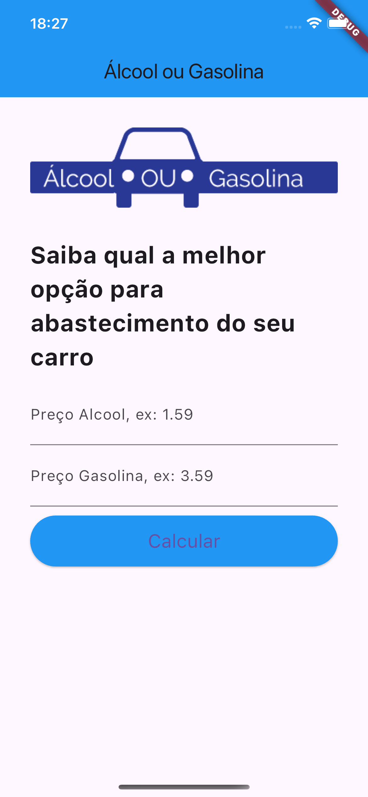

# App "Álcool ou Gasolina"

## Descrição

Um aplicativo desenvolvido durante o curso de Desenvolvimento Flutter Mobile, com o objetivo de criar uma lógica simples, que recebe o valor do álcool e gasolina e verifica qual fica mais barato para abastecer .

## Curso

**Desenvolvimento Android e IOS com Flutter - Crie 15 Apps**

[Link para o curso na Udemy](https://www.udemy.com/course/desenvolvimento-android-e-ios-com-flutter/?couponCode=MCLARENT71824)

## Status do Projeto

- **Concluído:** 12/10/2021
- **Atualizado:** 30/07/2024

## Tecnologias Utilizadas


## Funcionalidades

- Comparação de preços de combustíveis.

## Instalação

Siga os passos abaixo para rodar o projeto localmente:

1. Clone o repositório:
    ```sh
    git clone https://github.com/rafaelleonan/app-flutter-alcool-ou-gasolina.git
    ```
2. Navegue até o diretório do projeto:
    ```sh
    cd app-flutter-alcool-ou-gasolina 
    ```
3. Instale as dependências:
    ```sh
    flutter pub get
    ```
4. Execute o aplicativo:
    ```sh
    flutter run
    ```

## Tela
<p>
  
</p>

## Video Demonstração
[Assista o vídeo](https://ucd90df16b142a4f99316da56b87.dl.dropboxusercontent.com/cd/0/inline/CXz7KHTbX3S_TNEUjpleUpzmT3TuGWDTj_DL3LzezwApTjhgLDklgzZPNFSVvQzumzT_0LDnMfPUZyByFeumAC8qm_0v5cCpd3xfqokhkGgviB00-KgKw6dOFqFK1jOcQZDmzG6xZHurldNNWr7LcyMn/file#) 
